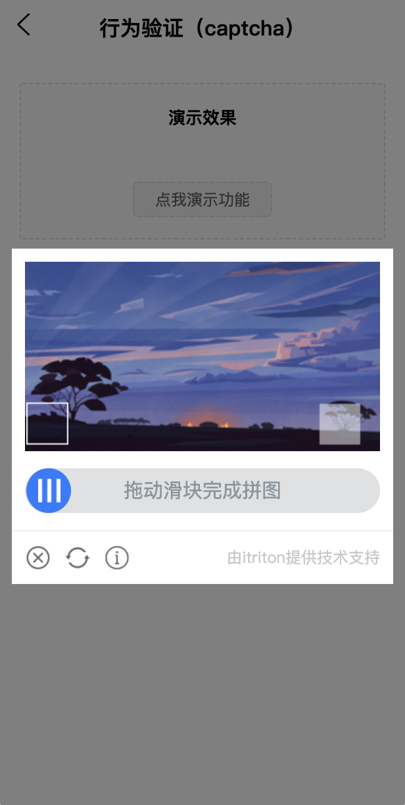

# itriton-captcha

[](https://gitee.com/ibaleine-open-source/itriton-captcha/stargazers)
[](https://gitee.com/ibaleine-open-source/itriton-captcha/members)

[](https://github.com/icjs-cc/itriton-captcha)

### 介绍
生成滑动验证码拼图图片和背景图片

### 安装
`npm i @itriton/captcha`

### 使用方法
```
const captcha = require('@itriton/captcha')

// 默认(promise)
captcha.create().then(res=>{
    console.log(res)
})

// 自定义参数(promise)
captcha.create(options).then(res=>{
    console.log(res)
})

// 默认(async/await)
async function captcha(){
   const result = await captcha.create()
}

// 自定义参数(async/await)
async function captcha(){
   const result = await captcha.create(options)
}
```

#### 参数

| 属性名    | 类型    | 默认值     | 说明              |
| --------- | ------- | ---------- | ----------------- |
| size    | Number  | 30         | 默认拼图大小        |
| width    | Number  | 270         | 图片宽度(px)        |
| height  | Number  | 144 | 图片高度(px)  |
| url  | String  | - | 图片路径（支持在线地址）  |

#### 返回值

| 属性名    | 类型    | 说明     |
| --------- | ------- | ---------- |
| backgroundImage    | Base64  | 背景图片        |
| jigsawImage    | Base64  | 拼图图片       |
| x  | Number  |   x轴距离|

### 安装sharp失败的解决方案  

切换成淘宝镜像再执行`npm install sharp`命令
```
npm config set sharp_binary_host "https://npm.taobao.org/mirrors/sharp"

npm config set sharp_libvips_binary_host "https://npm.taobao.org/mirrors/sharp-libvips"

npm install sharp
```


### 效果图
> 结合 [@itriton/uniapp](http://itriton.icjs.ink/itriton/uniapp/start/introduce.html) 组件库的 [行为验证（captcha）](http://itriton.icjs.ink/itriton/uniapp/components/captcha.html)组件的实际效果

